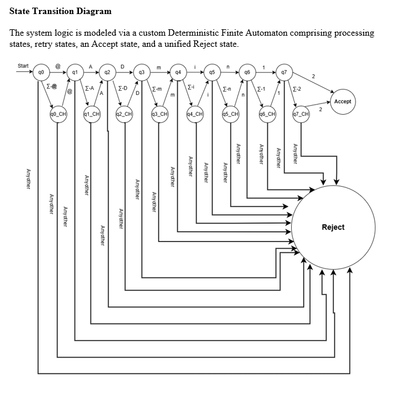
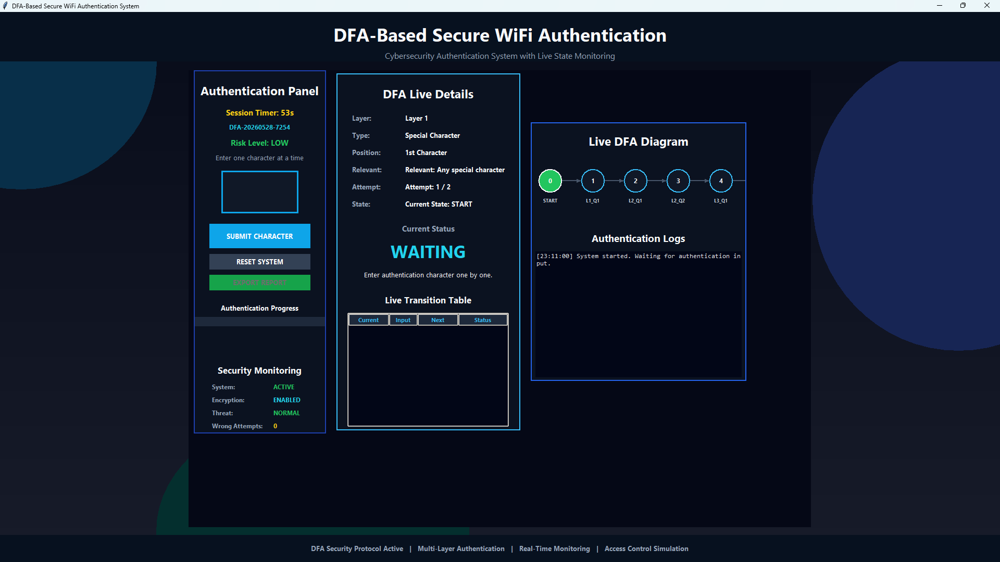
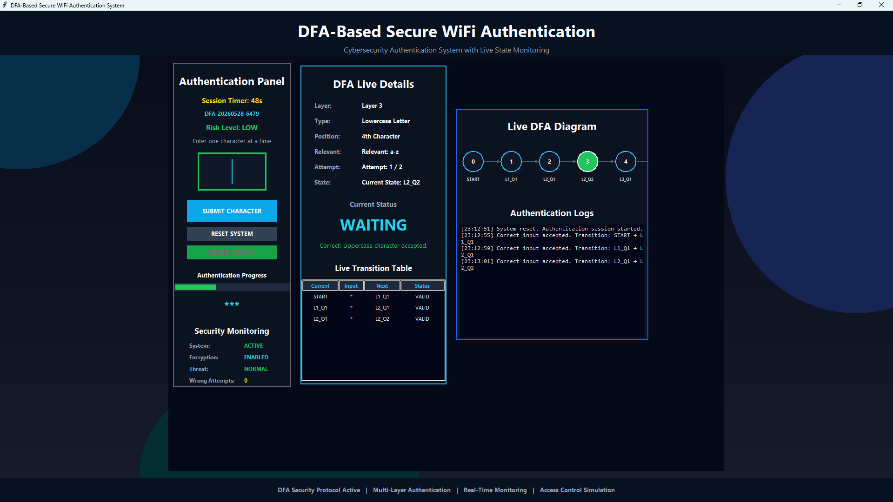
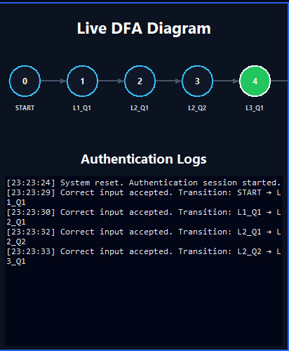
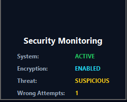
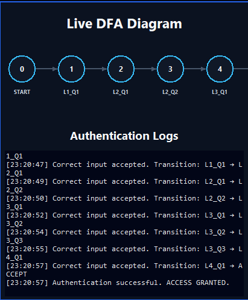
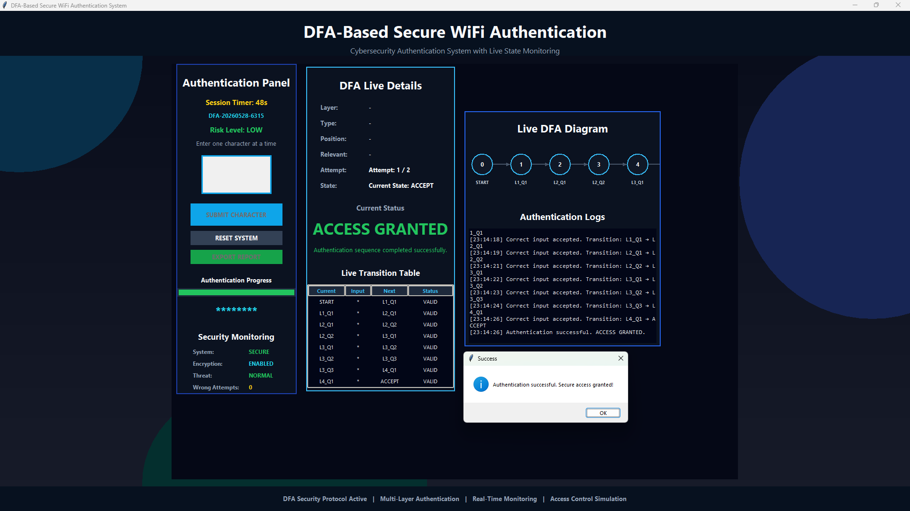
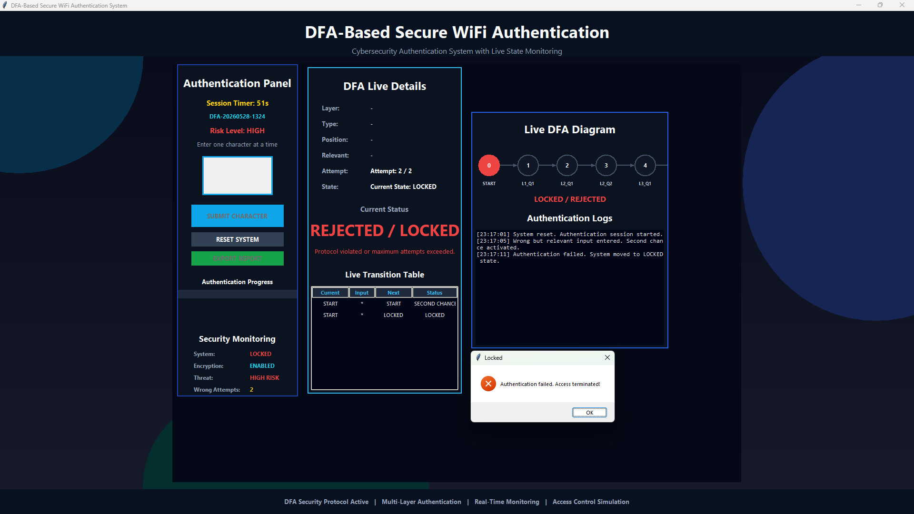
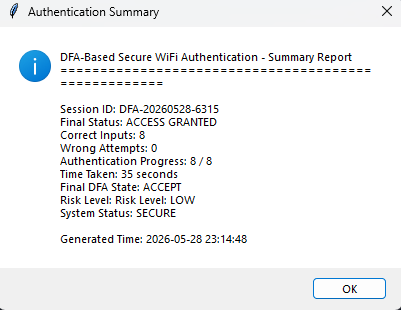

# 🔐 DFA-Based Secure WiFi Authentication System

> A robust, interactive desktop cybersecurity application simulating a secure multi-layer WiFi authentication process driven by Deterministic Finite Automata (DFA) logic.

Welcome to our collaborative security project! We developed this application to demonstrate how core theoretical concepts like DFA can be seamlessly integrated with practical cybersecurity logic. From character-by-character input validation to real-time risk monitoring and automated threat lockouts, this system simulates a highly secure and controlled access environment.

---

## 📌 Project Overview

The main purpose of this project is to simulate a **secure WiFi authentication system** where users are authenticated through a **multi-layer DFA-based validation process**.

The system validates user input **character by character**, tracks authentication progress, monitors suspicious activity, and automatically **locks unauthorized access attempts** when the protocol is violated.

This project combines **Cybersecurity concepts + Python GUI development + DFA logic implementation** into one interactive system.

---

## 🚀 Key Features

✅ DFA-based secure authentication logic

✅ Character-by-character input validation

✅ Multi-layer authentication workflow

✅ Live DFA state transition monitoring

✅ Session timer with timeout protection

✅ Security risk level monitoring

✅ Authentication logs system

✅ DFA transition table visualization

✅ Access Granted / Locked system

✅ Authentication report generation & export

---

## 🛠️ Technologies Used

* **Python**
  
* **Tkinter (GUI Development)**
  
* **Deterministic Finite Automata (DFA)**
  
* **Cybersecurity Authentication Logic**
  
* **State Transition Monitoring**

---

## 📸 Project Screenshots

### 🧠 DFA State Transition Diagram

This diagram represents the complete DFA-based authentication workflow, including valid transitions, retry states, acceptance, and rejection paths.




### 🏠 Main Interface

Displays the complete authentication system interface including DFA monitoring and security status.



---

### 🔄 Authentication Transition Process

Demonstrates the real-time DFA authentication workflow and character-by-character validation.



---

### 🧠 Live DFA Diagram

Shows live DFA state transitions during the authentication process.



---

### 🛡️ Security Monitoring

Displays security risk level, threat status, and unauthorized attempt tracking.



---

### 📝 Authentication Logs

Tracks real-time authentication activity and DFA transition logs.



---

### ✅ Access Granted

Shows successful authentication after completing the correct DFA sequence.



---

### ❌ Locked State

Demonstrates system lock after invalid authentication attempts or protocol violation.



---

### 📄 Authentication Report

Displays generated authentication summary and export report.



---

## ⚙️ How to Run This Project

### 1️⃣ Clone the Repository

```bash
git clone https://github.com/your-username/secure-wifi-authentication-dfa.git
```

### 2️⃣ Navigate to the Project Directory

```bash
cd secure-wifi-authentication-dfa
```

### 3️⃣ Run the Application

```bash
python app.py
```

---

## 🎯 Learning Outcome

This project helped me gain practical experience in:

* DFA Implementation using Python
  
* Cybersecurity Authentication Workflow
  
* Python GUI Development with Tkinter
  
* State Transition Logic
  
* Security Risk Monitoring
  
* Authentication Logging & Access Control
  
* Report Generation using Python
  

---
## 👥 Core Developers & Contributors

This system was collaboratively engineered by:

**Rifat Bin Tayub**
* **Role:** Core DFA Logic Implementation, State Transition Modeling & Authentication Workflow
* Cyber Security Enthusiast | Python Learner | Exploring Ethical Hacking & Cyber Defense
* GitHub: [@rifatb794](https://github.com/rifatb794)

**Sumiaya Afrin**
* **Role:** GUI Development (Tkinter), Security Risk Monitoring & Automated Logging/Reporting
* Information Security Enthusiast | Python Programmer | Passionate about Penetration Testing & Cyber Threats
* GitHub: [@srabonis181-hue](https://github.com/srabonis181-hue)
